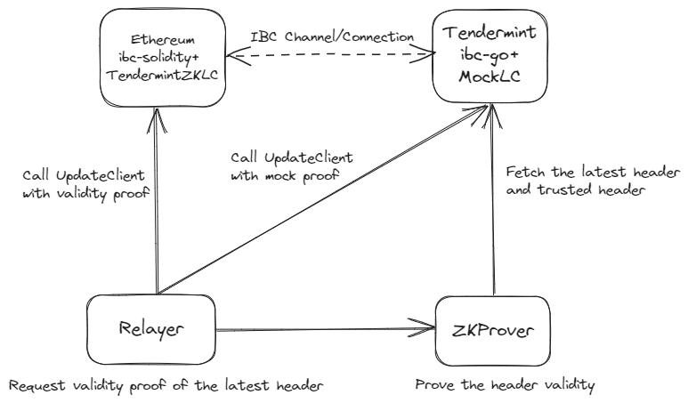

# tendermint-zk-ibc

## Overview

This repository provides `TendermintZKLightClient` contract, a Solidity implementation of a Zero-Knowledge Proof (ZKP)-based Tendermint light client for [IBC](https://github.com/cosmos/ibc). Furthermore, it also provides an IBC relayer support and a ZK prover using Succinct's [TendermintX](https://github.com/succinctlabs/tendermintx). By utilizing [ibc-solidity](https://github.com/hyperledger-labs/yui-ibc-solidity) and these components, we can achieve IBC between EVM chains(e.g. Ethereum mainnet) and Cosmos zones at a practical gas cost.

The following figure shows the high-level architecture of [the E2E demo](./github/workflows/test.yml) using the components included in this repository. Note that [Mock-LC](https://github.com/datachainlab/ibc-mock-client) is currently used as IBC Light Client on Tendermint instead of verifying Ethereum consensus. This will soon be replaced by [08-wasm](https://github.com/cosmos/ibc-go/tree/main/modules/light-clients/08-wasm) + [ethereum-ibc-rs](https://github.com/datachainlab/ethereum-ibc-rs).

## Components

### [TendermintZKLightClient](./contracts/TendermintZKLightClient.sol)

`TendermintZKLightClient` is a Solidity contract that implements a ZKP-based light client for Tendermint and `ILightClient` interface of ibc-solidity. This consists of the following parts:

- ZKP-verifier for header: It verifies a validity proof of header, which is a recursive proof with Groth16/PLONK for TendermintX circuit proof. Note that the trusting period validation and the merkle tree verification for block timestamp and appHash from the header are processed on-chain for now. We will soon improve the circuit to include these verifications.
- State membership/non-membership verifier: A merkle proof verifier implementation optimized for Simple tree and IAVL tree proof specs

Developers can construct their own LightClient contract using a zkp verifier contract according to the verifying key they performed setup and generated.

An example implementation can be found here:

- [Groth16](./contracts/groth16/TendermintZKLightClientGroth16.sol)
- [PLONK](./contracts/plonk/TendermintZKLightClientPlonk.sol)

### [ZKProver](./src)

ZKProver is a component that prove validity of given header and provides its proof to the relayer.

This component consists of the following two sub-components:

- [plonky2-prover](./src) that runs TendermintX circuit to generates proof and prove recursively it using Poseidon BN128 hash
- [gnark-verifier](./go) that recursively proves the proof from plonky2-prover service utilizing [gnark-plonky2-verifier](https://github.com/succinctlabs/gnark-plonky2-verifier) for Groth16/PLONK proof

### [Relayer](./go/relay)

Relayer is a component that requests validity proof of the latest header from ZKProver and calls the updateClient function of the `TendermintZKLightClient` contract with the proof. This is implemented as [prover module](https://github.com/hyperledger-labs/yui-relayer?tab=readme-ov-file#glossary) of [yui-relayer](https://github.com/hyperledger-labs/yui-relayer).

## Benchmark

The following is the gas report for the `TendermintZKLightClient` contract. The gas is measured using `forge test` and the below settings.

Settings:
- Solidity v0.8.24
- optimizer_runs=9999999
- via-ir=true
- evm_version=paris

| Method | Proving System | Gas Cost |
| --- | --- | --- |
| updateClient | Groth16 | 285k |
| updateClient | Groth16 (w/commit range checker) | 407k |
| updateClient | PLONK | 370k |
| verifyMembership | * | 56k |

## TODO

- Add misbehaviour support
- Further gas cost optimization
    - Optimize circuit for IBC light client
    - e.g. remove simple tree verification on-chain
- Reduce ZKProver's proving time
- Improve the E2E demo
    - Replace Mock-LC with 08-wasm + ethereum-ibc-rs
